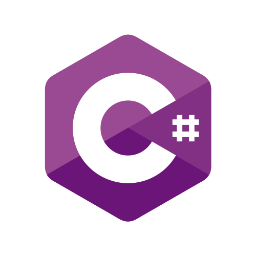

## Hi there 👋

My name is estani sarandón and I'm a software developer.

After a decade of leading sustainability projects ♻️, I decided to pursue my dream of becoming a software developer 🖥️. 
With a solid foundation in backend technologies like JavaScript, C#, and Python, and experience in IoT and embedded systems, I’m ready to build secure and efficient applications. My curiosity drives me to understand how things work—from inspecting to repairing 🪛—and now I’m eager to bring that passion into software development. 

I’m excited to put all this passion and curiosity into action and reach the next stage in my journey as a developer. 🚀.

🔧 Technologies & Tools
---

 

       

               

